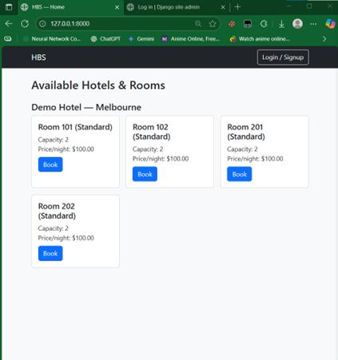
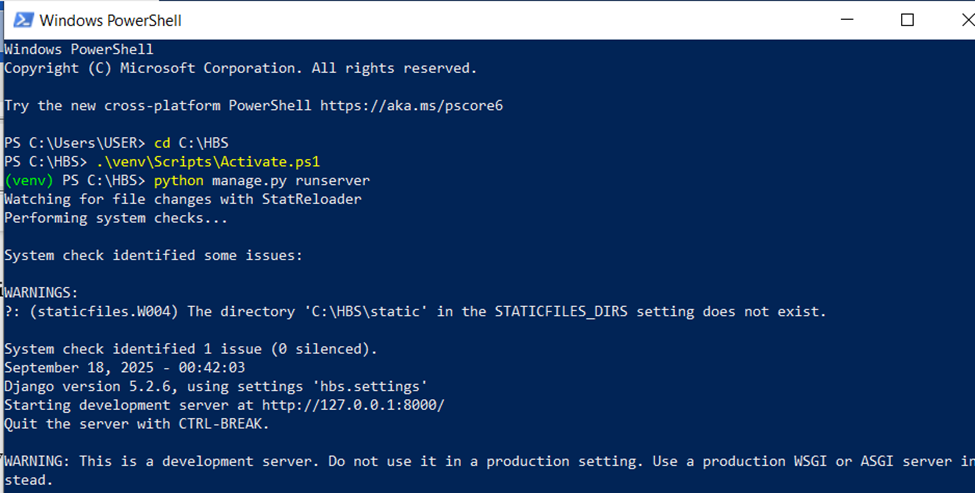

# 🏨 Hotel Booking System (HBS)

The **Hotel Booking System (HBS)** is a Django-based web application that allows small accommodation providers to manage hotel rooms, accept bookings, and process payments online.
This project was developed as part of an Advanced Software Engineering coursework to demonstrate full-stack development, Agile practices, and secure system design.

---

## ✨ Features

* **Public Home Page**
  Displays a demo hotel in Melbourne with room listings, capacity, and nightly price.

* **Authentication (Django Auth)**

  * User registration and login.
  * Secure password hashing (PBKDF2).

* **Booking Workflow**

  * Book rooms with check-in/out dates.
  * Price calculation per night.
  * Overlap validation (no double bookings).
  * Choose **“Pay Now”** (Stripe Checkout) or **“Pay Later”** (status = PENDING).

* **My Bookings**

  * Users can view booking history.
  * Payment status displayed (PAID/PENDING).
  * Option to complete unpaid bookings.

* **Admin Panel**

  * Manage Hotels, Rooms, and Bookings.
  * User management.

* **Payments**

  * Stripe Checkout integration for secure online payments.

* **Security**

  * Static checks (Bandit, pip-audit).
  * Dynamic scan (OWASP ZAP baseline).
  * Secrets stored in `.env`.

---

## 🛠️ Tech Stack

* **Backend:** Python 3.11, Django 5
* **Frontend:** HTML, Bootstrap
* **Database:** SQLite (development), PostgreSQL (planned for production)
* **Payments:** Stripe Checkout API
* **Tools:** Git, VS Code, pipenv/venv, GitHub Actions (CI/CD ready)

---

## 🚀 Installation Guide

Follow these steps on **Windows**:

### 1. Clone the Repository

```bash
git clone https://github.com/your-username/hotel-booking-system.git
cd hotel-booking-system
```

### 2. Create Virtual Environment

```bash
python -m venv venv
venv\Scripts\activate
```

### 3. Install Dependencies

```bash
pip install -r requirements.txt
```

### 4. Setup Environment Variables

Create a `.env` file in the project root:

```env
SECRET_KEY=your-django-secret-key
DEBUG=True
STRIPE_PUBLIC_KEY=pk_test_xxxxxxxxxxxxx
STRIPE_SECRET_KEY=sk_test_xxxxxxxxxxxxx
```

### 5. Apply Migrations

```bash
python manage.py migrate
```

### 6. Create Superuser

```bash
python manage.py createsuperuser
```

### 7. Run Server

```bash
python manage.py runserver
```

Open: [http://127.0.0.1:8000](http://127.0.0.1:8000)

---

## 🔑 Default Roles

* **User:** Can register, log in, book rooms, and pay.
* **Admin:** Manage hotels, rooms, and bookings via Django Admin.

---

## 🧪 Testing

* **Unit Tests:** Booking overlap validation, authentication.
* **Static Testing:**

  * `flake8` (linting)
  * `bandit` (security scan)
  * `safety` or `pip-audit` (dependency scan)
* **Dynamic Testing:** OWASP ZAP baseline scan, Locust load tests.

Run all tests:

```bash
python manage.py test
```

---





---

## 📌 Roadmap / Future Enhancements

* Multi-hotel support with city/location filtering.
* Email notifications for bookings.
* Analytics dashboard for admins.
* Alternative payment gateways (PayPal, Apple Pay).
* API-first design using Django REST Framework for mobile apps.
* Deployment to AWS/Heroku with PostgreSQL and HTTPS.

---


---

## 📄 License

This project is developed for educational purposes under [MIT License](LICENSE).

For any further Inquiry, email me: nazmussakib.net@gmail.com
